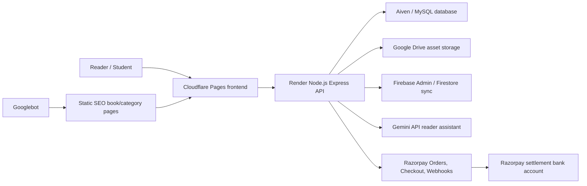

# E-Library

E-Library is a full-stack digital reading platform built by **Padam Kishore**. It provides a fast public book discovery experience, browser-based PDF and EPUB reading, Google sign-in, an owner/admin book management system, premium access controls, Razorpay payments, a supporter donation page, AI-assisted reading help, and SEO-ready public book pages.

[](https://e-library-c9t.pages.dev/)
[](https://pages.cloudflare.com/)
[](PDF-Library/backend)
[](PDF-Library/sql)
[](PDF-Library/backend/src/services/paymentService.js)

## Project Snapshot

| Area | Implementation |
| --- | --- |
| Public site | Static HTML, CSS, and JavaScript hosted on Cloudflare Pages |
| Backend API | Node.js, Express, MySQL connection pooling, rate limits, and security headers |
| Database | MySQL schema with books, users, admin audit logs, payment orders, entitlements, and supporter contributions |
| Auth | Google sign-in, backend token verification, signed session cookie, bearer fallback, CSRF for admin routes |
| Storage | Google Drive API for PDF, EPUB, cover, video, and supporter media assets |
| Payments | Razorpay Orders API, Standard Checkout, signature verification, webhook confirmation |
| Reading | Public previews, signed-in full reading, PDF viewer, EPUB viewer, reader controls, AI sidebar |
| Admin | Book CRUD, bulk import, private/public visibility, payment settings, premium rules, admin management |
| SEO | Static indexable book pages, category pages, language pages, `robots.txt`, `sitemap.xml`, canonical URLs, JSON-LD |
| Support | Standalone support page with profile, social links, INR checkout, local currency estimate, optional media message |

## Why This Project Stands Out

- It is not a static landing page. It is a working library system with real backend routes, database schema, admin workflows, payments, storage, authentication, and public SEO pages.
- It separates public discovery from protected reading and admin management.
- It treats Google search as a first-class requirement through static SEO pages and a submitted sitemap.
- It uses web-friendly free-tier deployment choices while documenting the production limitations of free compute/database plans.
- It has a practical owner workflow: add books, import many books, make books private or public, configure premium access, review payments, and keep public pages discoverable.

## Live Links

- Public site: [https://e-library-c9t.pages.dev/](https://e-library-c9t.pages.dev/)
- Sitemap: [https://e-library-c9t.pages.dev/sitemap.xml](https://e-library-c9t.pages.dev/sitemap.xml)
- Support page: [https://e-library-c9t.pages.dev/support.html](https://e-library-c9t.pages.dev/support.html)
- GitHub profile: [https://github.com/padam421](https://github.com/padam421)
- LinkedIn profile: [https://www.linkedin.com/in/padam-kishore-031b8b377/](https://www.linkedin.com/in/padam-kishore-031b8b377/)

## Architecture



### Request Flow

1. A reader opens the Cloudflare Pages frontend.
2. Public book data loads from `GET /api/pdfs`.
3. Public previews use `/api/pdfs/book/:bookId/preview` or EPUB preview endpoints.
4. Full PDF/EPUB streams require a verified session.
5. Google sign-in sends an access token to the backend, where it is verified before the app creates a session.
6. Premium and support payments create Razorpay orders on the backend.
7. Razorpay checkout returns a signed payment response, and the backend verifies it before granting access or recording support.
8. Webhooks provide server-to-server confirmation if the browser closes after payment.

## Feature Highlights

### Public Library

- Searchable, responsive home page.
- Book cards with title, author, category, cover, and media availability.
- Clean public book detail page.
- Separate PDF and EPUB reading experiences.
- Public preview mode for signed-out users.
- Full reading mode for signed-in users.
- Reader controls for navigation and reading flow.

### Authentication

- Google Identity Services on the frontend.
- Backend Google access-token verification.
- Session cookie plus local bearer-token fallback.
- Owner/admin role enforcement.
- CSRF protection on admin mutations.

### Admin Portal

- Add a single book.
- Import books in bulk from structured data.
- Edit and delete books.
- Mark books private or public.
- Manage admin users.
- View admin activity logs.
- Configure payment settings and premium book rules.

### Payments And Support

- Razorpay order creation happens only on the backend.
- Razorpay key secret and webhook secret are never exposed to frontend code.
- Checkout signatures are verified with HMAC.
- Webhook signatures are verified from the raw request body.
- Payment records are stored in MySQL.
- Premium purchases create user entitlements.
- Support contributions are stored separately with optional public messages.
- Support media uploads are allowed only after payment succeeds.

### AI Reader Assistant

- Website-aware and reader-aware prompt context.
- Gemini model fallback strategy.
- Optional file extraction with PDF text parsing and OCR support.
- Rate limits and safety-oriented system instructions.

### SEO And Discoverability

- Homepage metadata, Open Graph, Twitter card metadata, and JSON-LD.
- Public static book pages at clean URLs such as:

```text
/books/1/captain-blood-rafael-sabatini/
```

- Category and language pages such as:

```text
/books/category/business-and-economics/
/books/language/english/
```

- Canonical URLs for indexable pages.
- `robots.txt` points to `sitemap.xml`.
- Static `sitemap.xml` is committed so Cloudflare Pages serves it reliably.
- Private pages such as admin, reader, and checkout/support utility surfaces are marked with `noindex` where appropriate.

## Repository Structure

```text
E-LIBRARY/
  .github/                       GitHub workflow and contribution templates
  docs/                          Architecture, setup, deployment, and SEO notes
  PDF-Library/
    frontend/
      index.html                 Public library homepage
      support.html               Standalone support page
      book-detail.html           Dynamic book detail view
      view-pdf.html              PDF reader
      view-epub.html             EPUB reader
      books/                     Static SEO book/category/language pages
      assets/
        css/                     Site, reader, SEO, and support styling
        js/                      Frontend app, auth, reader, payment, support logic
        images/                  Logo and Padam Kishore profile assets
      functions/                 Cloudflare Function SEO route implementation
      robots.txt                 Crawl rules
      sitemap.xml                Static sitemap submitted to Search Console
      _headers                   Cloudflare headers and noindex rules
    backend/
      src/
        app.js                   Express app, middleware, route mounting
        server.js                Production server entry
        config/                  Environment, database, Drive, Firebase, runtime config
        controllers/             Route handlers
        middleware/              Rate limits, admin guard, CSRF, error handling
        models/                  Public book data access
        routes/                  API route definitions
        services/                Razorpay/payment business logic
        utils/                   Google token and session helpers
      scripts/                   Setup, migration, preflight, secret-check helpers
      Dockerfile                 Backend container deploy file
      package.json               Backend scripts and dependencies
    sql/                         MySQL schema and migration scripts
    DEPLOYMENT.md                Production checklist and hosting notes
```

## Local Development

### Prerequisites

- Node.js 18 or newer.
- MySQL-compatible database.
- Google OAuth client ID.
- Google Drive OAuth credentials and refresh token.
- Firebase Admin credentials if auth syncing is enabled.
- Razorpay test keys if payment flow is being tested.
- Gemini API key if the AI assistant is being tested.

### Backend Setup

```powershell
cd PDF-Library/backend
npm install
Copy-Item .env.example .env
```

Fill `.env` with local values. Never commit real `.env` files.

Run schema scripts on a fresh database in this order:

```text
PDF-Library/sql/001_schema.sql
PDF-Library/sql/003_repair_books_schema.sql
PDF-Library/sql/004_admin_audit_log.sql
PDF-Library/sql/005_payments.sql
PDF-Library/sql/006_support_contributions.sql
```

Start the backend:

```powershell
npm start
```

Useful backend checks:

```powershell
npm run check
npm run check:secret-files
npm run check:production-env
npm run setup:payments
npm run repair:books-schema
```

### Frontend Setup

For local static testing, serve `PDF-Library/frontend` with any static server. For example:

```powershell
cd PDF-Library/frontend
python -m http.server 5500
```

Open:

```text
http://127.0.0.1:5500/
```

Update `PDF-Library/frontend/assets/js/config.js` when pointing the frontend at a different backend:

```js
window.PDF_LIBRARY_CONFIG = {
  API_ORIGIN: "https://your-backend-domain.example",
  GOOGLE_CLIENT_ID: "your-google-client-id.apps.googleusercontent.com",
};
```

## Environment Variables

Use `.env.example` files as the source of truth:

- [PDF-Library/.env.example](PDF-Library/.env.example)
- [PDF-Library/backend/.env.example](PDF-Library/backend/.env.example)

Important production variables include:

| Variable | Purpose |
| --- | --- |
| `NODE_ENV` | Must be `production` in production |
| `CORS_ORIGIN` | Comma-separated allowed frontend origins |
| `DB_HOST`, `DB_PORT`, `DB_USER`, `DB_PASSWORD`, `DB_NAME` | MySQL connection |
| `DB_SSL`, `DB_SSL_REJECT_UNAUTHORIZED` | SSL behavior for hosted databases |
| `GOOGLE_CLIENT_ID` | Google sign-in verification |
| `DRIVE_CLIENT_ID`, `DRIVE_CLIENT_SECRET`, `DRIVE_REFRESH_TOKEN` | Google Drive asset access |
| `FIREBASE_SERVICE_ACCOUNT_BASE64` | Firebase Admin service account for hosting |
| `SESSION_TOKEN_SECRET` | Signed session token secret |
| `RAZORPAY_KEY_ID`, `RAZORPAY_KEY_SECRET`, `RAZORPAY_WEBHOOK_SECRET` | Payment gateway |
| `SUPPORT_MEDIA_DRIVE_FOLDER_ID` | Optional private Drive folder for supporter media |
| `GEMINI_API_KEY` or `GEMINI_API_KEYS` | AI assistant |

## Deployment Notes

### Frontend

Recommended free deployment:

- Platform: Cloudflare Pages.
- Project root: `PDF-Library/frontend`.
- Build command: none.
- Output directory: `/` or project root, depending on Cloudflare's UI for direct static uploads.

The current public frontend is already served at:

```text
https://e-library-c9t.pages.dev/
```

### Backend

Recommended free deployment:

- Platform: Render Web Service.
- Runtime: Docker or Node.
- Start command: `npm start`.
- Root directory: `PDF-Library/backend`.
- Health endpoint: `/api/health`.
- Warm endpoint for monitoring: `/api/health/warm`.

Free backend/database plans can sleep. The code includes health and database warmup endpoints, but a true always-on guarantee normally requires an always-on paid compute and database plan.

### Database

The backend uses MySQL. Hosted MySQL values are configured through environment variables. Migration files live in `PDF-Library/sql`.

### Razorpay

Configure the webhook URL in Razorpay:

```text
https://your-backend-domain.com/api/payments/webhook/razorpay
```

Enable at least:

```text
payment.captured
order.paid
```

Razorpay settlement goes to the bank account configured inside the Razorpay dashboard, not to a value stored in this repository.

## Security

- Real `.env` files are ignored.
- Service-account JSON files are ignored.
- Database backups are ignored.
- Razorpay secrets are backend-only.
- Webhook verification uses the raw request body.
- Admin routes require a verified admin session and CSRF token.
- Rate limits protect public, auth, payment, support, AI, and admin routes.
- Public book asset URLs use book-scoped proxy routes instead of exposing raw Drive IDs in the UI.

Before production deployment:

```powershell
cd PDF-Library/backend
npm run check:secret-files
npm run check:production-env
```

## SEO Workflow

1. Keep every public book page reachable by a clean URL in `PDF-Library/frontend/books/`.
2. Keep the static `PDF-Library/frontend/sitemap.xml` updated after adding many books.
3. Submit `sitemap.xml` in Google Search Console.
4. Use URL Inspection for important pages.
5. Write original descriptions for each book.
6. Avoid copied descriptions, fake backlinks, keyword stuffing, and copyrighted uploads without permission.

Technical SEO files:

- [robots.txt](PDF-Library/frontend/robots.txt)
- [sitemap.xml](PDF-Library/frontend/sitemap.xml)
- [SEO CSS](PDF-Library/frontend/assets/css/seo.css)
- [Cloudflare SEO functions](PDF-Library/frontend/functions)

## Testing And Verification

Current automated checks:

```powershell
cd PDF-Library/backend
npm run check
npm run check:secret-files
```

Recommended manual verification:

- Homepage loads on desktop and mobile.
- Public book preview opens without sign-in.
- Full reader requires sign-in when payments/access rules require it.
- Google sign-in restores a session.
- Admin portal blocks non-admin users.
- Razorpay test checkout creates and verifies orders.
- Razorpay webhook marks paid orders if the browser closes.
- Support page accepts INR 1 or more, opens checkout, and records public supporters.
- `https://e-library-c9t.pages.dev/sitemap.xml` returns XML.
- Sample book pages pass Google URL Inspection.

## Roadmap

- Add a small script to regenerate static SEO pages after every book import.
- Add automated browser tests using Playwright with safe test sessions.
- Add CI database migration validation against a temporary MySQL service.
- Add richer book filtering and saved collections.
- Add multilingual SEO pages only after real translated content exists.
- Move to always-on production hosting when budget allows.

## Author

**Padam Kishore**

- GitHub: [padam421](https://github.com/padam421)
- LinkedIn: [padam-kishore-031b8b377](https://www.linkedin.com/in/padam-kishore-031b8b377/)

## Legal And Content Notice

Only upload books, covers, EPUBs, PDFs, videos, or summaries that are public domain, self-created, or used with permission. This matters for readers, for Google Search visibility, and for the long-term safety of the project.
