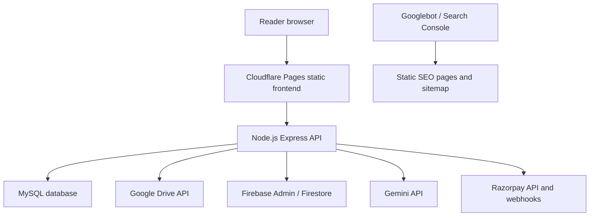
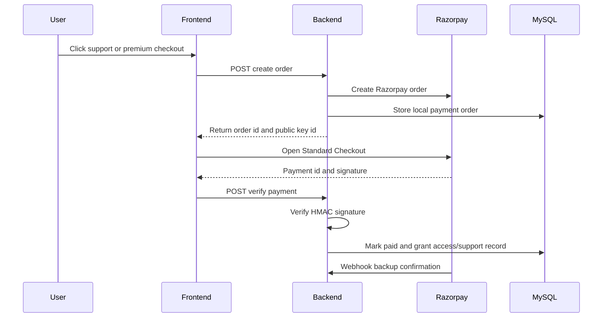

# Architecture

This document explains how E-Library is organized at a system level. It is written for reviewers, maintainers, and future deployment work.

## High-Level System



## Frontend

Location:

```text
PDF-Library/frontend/
```

The frontend is a static application built with HTML, CSS, and browser JavaScript. There is no compile step. It is suitable for Cloudflare Pages direct static hosting.

Important entry points:

| File | Purpose |
| --- | --- |
| `index.html` | Public homepage, search, book grids, footer CTA |
| `book-detail.html` | Dynamic detail view for a selected book |
| `view-pdf.html` | PDF reader |
| `view-epub.html` | EPUB reader |
| `admin-upload.html` | Owner/admin book and payment management |
| `support.html` | Standalone support contribution page |
| `assets/js/config.js` | Public frontend configuration |
| `assets/js/payments.js` | Razorpay checkout helper |
| `assets/js/support.js` | Support page form, recorder, recent supporters |
| `assets/js/auth.js` | Google sign-in and session persistence |
| `assets/js/pdf-engine.js` | PDF reader logic |
| `assets/js/epub-engine.js` | EPUB reader logic |
| `assets/js/ai-sidebar.js` | AI assistant UI |

## Backend

Location:

```text
PDF-Library/backend/
```

The backend is an Express API that owns every private operation:

- database access
- Google token verification
- session creation
- admin authorization
- Google Drive file access
- payment order creation
- payment signature verification
- webhook verification
- support media upload
- Gemini requests

Important files:

| File | Purpose |
| --- | --- |
| `src/app.js` | Express app setup, CORS, security headers, route mounting |
| `src/server.js` | Production server entry |
| `src/config/db.js` | MySQL pool, keep-alive, transient read retry |
| `src/config/drive.js` | Google Drive API client |
| `src/config/firebase.js` | Firebase Admin setup |
| `src/config/validateEnv.js` | Production environment preflight |
| `src/routes/*.js` | Route definitions |
| `src/controllers/*.js` | Request handlers |
| `src/services/paymentService.js` | Razorpay, entitlements, support contributions |
| `src/middleware/*.js` | Admin guard, CSRF, rate limiting, error handling |

## Database Model

Schema files live in:

```text
PDF-Library/sql/
```

Core tables:

| Table | Purpose |
| --- | --- |
| `users` | Google-authenticated users and roles |
| `books_data` | Book metadata and Drive asset references |
| `admin_activity_logs` | Owner/admin audit trail |
| `payment_settings` | Global payment and preview settings |
| `book_premium_rules` | Per-book premium status and price |
| `payment_orders` | Razorpay order/payment records |
| `user_entitlements` | Active premium access grants |
| `support_contributions` | Supporter names, messages, media metadata, payment status |

## Public Book Flow

1. Frontend calls `GET /api/pdfs`.
2. Backend reads public books from `books_data`.
3. The response returns book-scoped asset URLs such as `/api/pdfs/cover/:bookId`.
4. The browser does not need raw Google Drive IDs for public display.
5. Signed-out users can open previews.
6. Full streams require payment/access rules and a valid session when configured.

## Authentication Flow

1. Browser loads Google Identity Services.
2. User signs in with Google.
3. Frontend sends Google access token to `POST /api/auth/login`.
4. Backend verifies the token with Google.
5. Backend upserts the user in MySQL and syncs a Firestore record.
6. Backend returns a signed session token and CSRF token.
7. Admin routes require an admin user and CSRF token.

## Payment Flow



Security notes:

- `RAZORPAY_KEY_SECRET` stays on the backend.
- Checkout signatures are verified before access is granted.
- Webhooks use raw-body signature verification.
- Support media uploads are blocked until the order is marked paid.

## Support Contribution Flow

1. Reader opens `support.html`.
2. Frontend loads `GET /api/support/config`.
3. Reader enters an INR amount, name/email, optional message, and optional audio/video recording.
4. Backend creates a Razorpay support order.
5. Razorpay checkout completes.
6. Backend verifies the payment.
7. Recent supporters are loaded from `GET /api/support/recent`.
8. If media exists, frontend uploads it with the one-time support upload token.
9. Backend stores media in the configured private Google Drive folder.

## SEO Flow

Static pages are committed under:

```text
PDF-Library/frontend/books/
```

The live sitemap is:

```text
PDF-Library/frontend/sitemap.xml
```

This avoids relying on dynamic Cloudflare Functions for sitemap delivery. Each public book can have a clean, crawlable URL with title, author, description, canonical metadata, and structured data.

## Runtime Limits And Free Hosting Reality

The frontend is static and globally fast on Cloudflare Pages. The backend and database are the parts that can sleep on free tiers.

The code includes:

- `GET /api/health`
- `GET /api/health/warm`
- `GET /api/ping`
- MySQL pool keep-alive
- read-query retry for transient MySQL connection loss

These reduce cold-start and stale-connection problems, but they do not create a paid always-on SLA. For a permanent production guarantee, the backend compute and database need always-on plans.
